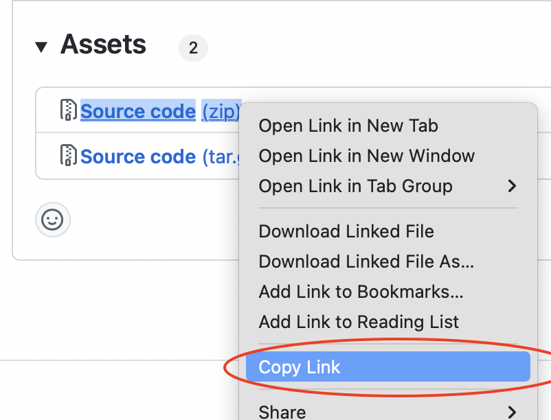

# Defold Fusion extension API documentation

Photon Fusion sdfsdf

## Installation

To use Photon Fusion in your Defold project, add a version of the Photon Fusion extension to your `game.project` dependencies from the list of available [Releases](https://github.com/defold/extension-photon-fusion/releases). Find the version you want, copy the URL to ZIP archive of the release and add it to the project dependencies.

Select `Project->Fetch Libraries` once you have added the version to `game.project` to download the version and make it available in your project.

## Usage

## License

You must read and agree to the [Exit Games End User License Terms](https://github.com/defold/extension-photon-fusion/blob/master/fusion/license.txt) before using Photon Realtime in your own project.

## Example

[Refer to the example project](https://github.com/defold/extension-photon-fusion/blob/master/example) to see a complete example of how the integration works. Video showing four connected clients:

## Source code

The source code is available on [GitHub](https://github.com/defold/extension-photon-fusion)
